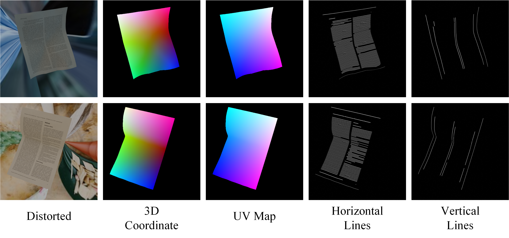

## DocDewarpHV

This repository provides a new and more fine-grained annotated distorted document training dataset called DocDewarpHV.

### Description

This dataset contains about 110K distorted document images in Chinese and English. 
The number of Chinese and English documents is close to 1:1. 
The resolution of each image is 512*512.
The source scanned images come from [cddod](https://github.com/kailigo/cddod), [CDLA](https://github.com/buptlihang/CDLA), 
[M6Doc](https://github.com/HCIILAB/M6Doc) and [PubLayNet](https://github.com/ibm-aur-nlp/PubLayNet).
Compared with [Doc3D](https://github.com/cvlab-stonybrook/doc3D-dataset), in addition to 3D world coordinates, UV map, 2D backward map (grid coordinates), 
we also provide horizontal and vertical line annotations that are consistent with the distortion trend of the input image.



### Data files tree

```
DocDewarpHV/
        alb_h/
            cddod_1/
                1-0_ann0001.png
                1-1_ann0001.png
                ...
            CDLA_1/
            M6Doc_test_1/
            publaynet_train_1/
            ...
        alb_v/
            cddod_1/
                1-0_ann0001.png
                ...
            ...
        bm/
            cddod_1/
                1-0_ann0001.mat
                ...
            ...
        uvmat/
             cddod_1/
                1-0_ann0001.mat
                ...
             ...
        warp_img/
             cddod_1/
                1-00001.png
                ...
             ...
        wc/
            cddod_1/
                1-0_ann0001.exr
                ...
            ...
        DocDewarpHV.txt
```

### How to obtain the dataset

You can download the entire DocDewarpHV dataset from [Baidu Netdisk](https://pan.baidu.com/s/1vuvm-f0wMuMivcV35VGbpA?pwd=uug6). Size: ~600GB.

### Dataset loading

You can directly execute the python file `doc_dewarp_hv_read.py` as follows. 
Remember to modify the dataset path in the main function. 
This code is also applicable to reading data when training your own rectification model.

`python loader/doc_dewarp_hv_read.py`

### License
The DocDewarpHV dataset should be used under [CC BY-NC-ND 4.0 License](https://creativecommons.org/licenses/by-nc-nd/4.0/) for non-commercial research purposes.

### Contact

If you have any questions about this dataset, you can always contact [hengli.lh@outlook.com](mailto:hengli.lh@outlook.com) 

### Acknowledgement
Thanks to [Doc3D](https://github.com/cvlab-stonybrook/doc3D-dataset), the code for this DocDewarpHV data synthesis is based on it.
We also thanks to [cddod](https://github.com/kailigo/cddod), [CDLA](https://github.com/buptlihang/CDLA), [M6Doc](https://github.com/HCIILAB/M6Doc) and [PubLayNet](https://github.com/ibm-aur-nlp/PubLayNet)
for their outstanding work in open-sourcing the original document images.

### Citation

```text
@article{li2025dual,
  title={Dual Dimensions Geometric Representation Learning Based Document Dewarping},
  author={Li, Heng and Chen, Qingcai and Wu, Xiangping},
  journal={arXiv preprint arXiv:2507.08492},
  year={2025}
}
```